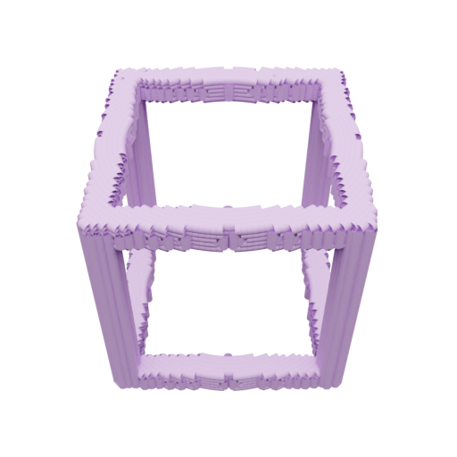
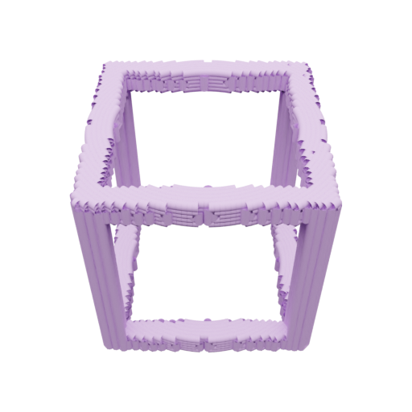
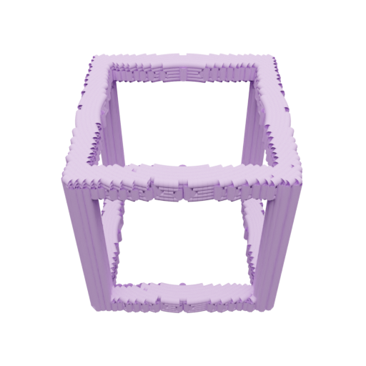
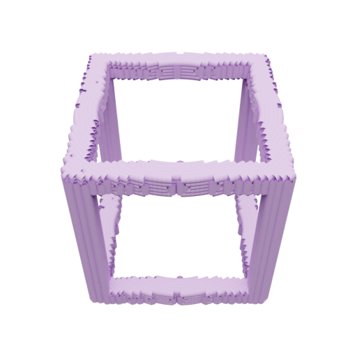

# Universal Multiplaner SWARM Slicer

## Installation

To install the software dependencies, run the following commands in your terminal:

```bash
# Clone the repository
git clone [https://github.com/gsznaier/Universal-Multiplaner-SWARM-Slicer.git](https://github.com/gsznaier/Universal-Multiplaner-SWARM-Slicer.git)
cd Universal-Multiplaner-SWARM-Slicer

# Create and activate conda environment
conda env create -f environment.yml
conda activate slicer

# Install local package in editable mode
pip install -e .
```

---

## Run Instructions

### Option 1: Run via Job Profile
Execute the slicer using a pre-configured JSON job profile:

```bash
python main.py --job ../job_profiles/example_job_profile_hollow_cube.json
```

### Option 2: Run via Individual Parameters
Alternatively, pass parameters directly through the command line:

```bash
python main.py \
  --job_names hollow_cube \
  --stl_names ../dataset/hollow_cube.stl \
  --printer_profiles ../printer_profiles/1_printer_profile_cylindrical_contour_1mm.json \
  --obj_scale 5.0
```

### Option 3: Reload Existing Results
To reload an already generated print job (e.g., to inspect or visualize without recomputing):

```bash
python main.py \
  --job_names hollow_cube \
  --stl_names ../dataset/hollow_cube.stl \
  --printer_profiles ../printer_profiles/1_printer_profile_cylindrical_contour_1mm.json \
  --obj_scale 5.0 \
  --load_data \
  --load_data_path ../results/shells
```

### Concentric Tube Robot (CTR) Profiles
To scale execution to multiple CTR printers, replace the `--printer_profiles` argument with one of the pre-configured system profiles:

| CTR Count | Profile Path |
| :--- | :--- |
| **1 CTR** | `../printer_profiles/1_printer_profile_cylindrical_contour_1mm.json` |
| **2 CTRs** | `../printer_profiles/2_printer_profile_cylindrical_contour_1mm.json` |
| **4 CTRs** | `../printer_profiles/4_printer_profile_cylindrical_contour_1mm.json` |
| **6 CTRs** | `../printer_profiles/6_printer_profile_cylindrical_contour_1mm.json` |
| **8 CTRs** | `../printer_profiles/8_printer_profile_cylindrical_contour_1mm.json` |
| **14 CTRs** | `../printer_profiles/14_printer_profile_cylindrical_contour_1mm.json` |

---

## Visualization

Resulting toolpaths can be visualized interactively using Matplotlib or saved directly to an output directory using Matplotlib or Blender:

```bash
# Interactive visualization (Matplotlib)
python main.py --job_names hollow_cube --stl_names ../dataset/hollow_cube.stl --printer_profiles ../printer_profiles/1_printer_profile_cylindrical_contour_1mm.json --obj_scale 5.0 --load_data --load_data_path ../results/shells --visualize_fit --visualize_result matplotlib

# Save Matplotlib renders to disk
python main.py --job_names hollow_cube --stl_names ../dataset/hollow_cube.stl --printer_profiles ../printer_profiles/1_printer_profile_cylindrical_contour_1mm.json --obj_scale 5.0 --load_data --load_data_path ../results/shells --visualize_fit --visualize_result matplotlib --save_visualization --save_visualization_path ../results/complete_job

# Save Blender renders to disk
python main.py --job_names hollow_cube --stl_names ../dataset/hollow_cube.stl --printer_profiles ../printer_profiles/1_printer_profile_cylindrical_contour_1mm.json --obj_scale 5.0 --load_data --load_data_path ../results/shells --visualize_fit --visualize_result blender --save_visualization --save_visualization_path ../results/complete_job
```

---

## Expected Output

Once execution finishes, a JSON file containing all generated print paths will be generated. This file includes:

* **`printer info`**: Configuration of the Concentric Tube Robot (CTR), including position, orientation, resolution, safety radius, and geometric properties.
* **`shell_method`**: Method used for generating print shells.
* **`lower_u` / `upper_u`**: Control effort boundaries.
* **`max_r` / `min_r`**: Radial extension limits of the CTR.
* **`max_z_dist` / `min_z_dist`**: Z-axis extension limits.
* **`potential_levels`**: Theoretical candidate shells for a given resolution.
* **`levels`**: Executable shells commanded to the CTR, containing detailed shell paths and print masks.

### Expected Visualization Sequence (Hollow Cube)

<table align="center">
  <tr>
    <td align="center"><br><sub>Frame 1</sub></td>
    <td align="center"><br><sub>Frame 2</sub></td>
    <td align="center"><br><sub>Frame 3</sub></td>
    <td align="center"><br><sub>Frame 4</sub></td>
  </tr>
  <tr>
    <td align="center"><br><sub>Frame 5</sub></td>
    <td align="center"><br><sub>Frame 6</sub></td>
    <td align="center"><br><sub>Frame 7</sub></td>
    <td align="center"><br><sub>Frame 8</sub></td>
  </tr>
</table>

---

## Software Versions

* **Operating System:** Ubuntu 18.04.6 LTS
* **Python:** 3.10
